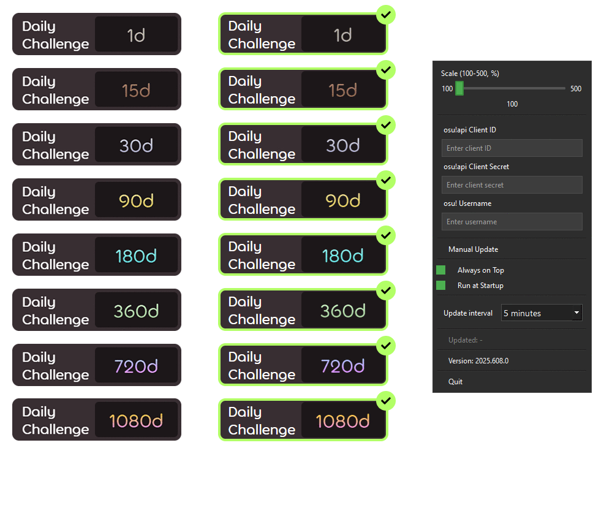

<h1 align="center">
    DCCW (Daily challenge completion widget)
</h1>

This widget designed for tracking daily challenge completion

  

# **WARNING**

**TESTED ONLY ON WINDOWS 10 AND WINDOWS 11**

i don't know how to code

98% github copilot + 1% chatgpt + 1% me

# HOW TO USE

Download DCCW.zip in releases (**WARNING**: next to the executable file, a settings file widget_settings.json is created, it is better to open the executable file in a separate folder).

For statistics update you need create "New OAuth Application" here - https://osu.ppy.sh/home/account/edit#oauth (as an example in the "Application Callback URLs" field you can specify `http://localhost:3456/`), then you need open widget settings (right click) and paste **Client ID**, **Client Secret** and **username** (You can pick any username).

Use context menu on right click to change settings (scaling, always on top toggle, run at startup toggle, change widget update timer, view last update statistic time, close widget).

# Screenshots

# Features

- Scaling from 100% to 500%
- Scaling and position save
- Sticking to the edge of the screen
- Always on top switch
- Precise movement of widget by arrows
- Autostart
- Manual update on button in context menu and on "F5"
- Ability to change widget update timer
- Tray icon
- Other daily challenge statistic popup at hover on widget

# My osu profile
- https://osu.ppy.sh/u/glebsin

727