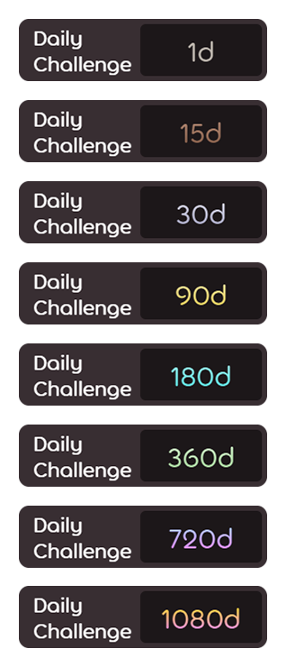
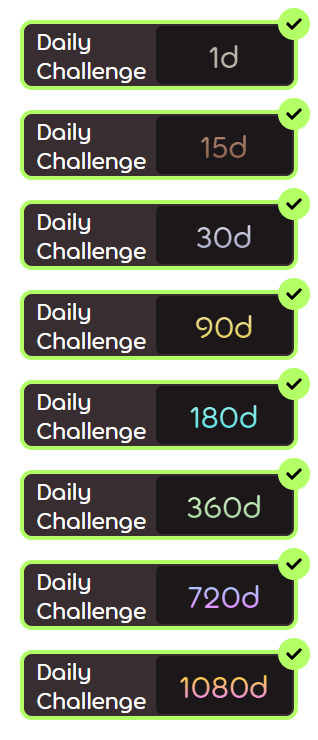

<h1 align="center">
    DCCW (Daily challenge completion widget)
</h1>

This widget is designed for tracking daily challenge completion

  

# **WARNING**

**TESTED ONLY ON WINDOWS 10**

i don't know how to code

98% github copilot + 1% chatgpt + 1% me

# HOW TO USE

Download executable in releases or compile widget.py (ask copilot or chatgpt how) (**WARNING**: next to the executable file, a settings file widget_settings.json is created, it is better to open the executable file in a separate folder).

For statistics update you need create "New OAuth Application" here - https://osu.ppy.sh/home/account/edit#oauth (as an example in the "Application Callback URLs" field you can specify `http://localhost:3456/`), then you need open widget settings (right click) and paste **Client ID**, **Client Secret** and **username**.

Use context menu on right click to change settings (scaling, always on top toggle, run at startup toggle, change updating time, view last update statistic time, exit).

# Screenshots

<table>
  <tr>
    <td align="center" width="50%">
       
      Uncomplitied widget
    </td>
    <td align="center" width="50%">
       
      Complitied widget
    </td>
  </tr>
</table>

<table>
  <tr>
    <td align="center" width="50%">
       
      Uncomplitied widget
    </td>
    <td align="center" width="50%">
       
      Complitied widget
    </td>
  </tr>
</table>

# Features

- Scaling from 100% to 500%
- Scaling and position save
- Sticking to the edge of the screen
- Always on top switch
- Precise movement of the widget by arrows
- Autostart
- Manual update on button in context menu and on "F5"
- Ability to change widget update time

# Todo
- Make theme customizing
- Make other statistic popup at hover
- Make ability to switch the number of days to best streak or current streak or total participation (now its only total participation)
- Make right colors for all number of days

727
